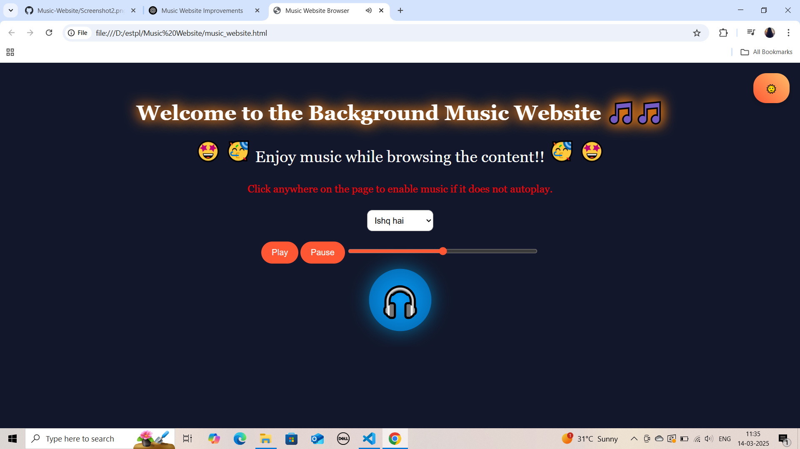
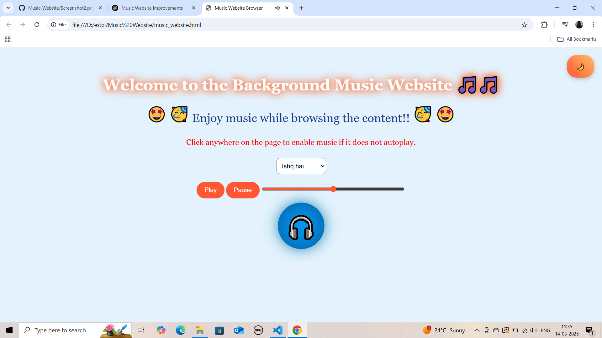

# music website

# 🎵 Music Website 🎶

A simple **Music Streaming Website** that allows users to play background music while browsing.

## 📸 Screenshot
  -> for dark theme  
  -> for light theme  

## 🌟 Features
✅ Play/Pause Music  
✅ Dark/Light Mode Toggle  
✅ Select Different Songs  
✅ Volume Control  
✅ Animated Music Notes 🎵  
✅ **Headphone Icon with Pulse Effect 🎧**  

This music website allows users to enjoy background music while browsing.  
It features a dark/light mode toggle, which changes the website theme between dark (🌙) and light (🌞).  
A notification informs users to click anywhere to enable music playback if autoplay is blocked.  
Users can select from multiple songs using a dropdown menu.  
The play, pause, and volume controls allow better audio management, with the volume adjustable between 0 and 1.  
The site remembers the last selected theme using localStorage, ensuring the same appearance when reopened.  

### 🎧 **Headphone Icon with Pulse Effect**
A **headphone emoji (🎧) with a glowing circular pulse effect** is added below the controls.  
- When the music **plays**, the circle **pulsates** to indicate active playback.  
- When the music **pauses**, the effect stops.  

Additionally, floating music note animations 🎵 enhance the experience, while the emojis in the text animate with a bouncing effect.  
The biggest challenge was storing the theme preference and ensuring smooth playback functionality.  
The website is fully interactive and provides a seamless music experience with user-friendly controls. 🎶✨  

---

## 🚀 How to Run

📌 Technologies Used  
- HTML, CSS, JavaScript  

### Steps:
1. Clone this repository:  
   ```sh
   git clone https://github.com/Namita-Sahoo/Music-Website.git
